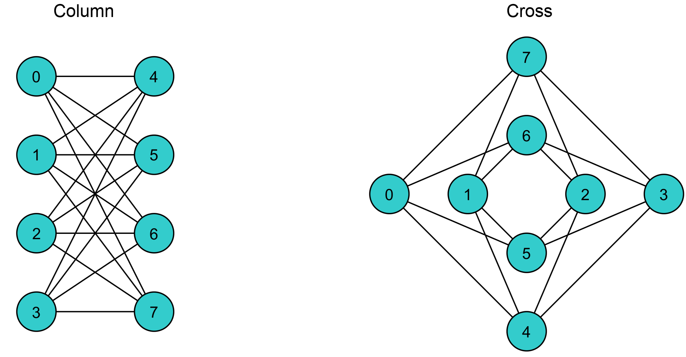

.. _Testing:

============================================================
D-Wave QPU Architecture: Chimera
============================================================

Understanding the layout of the D-Wave QPU is critical to translating a QUBO or Ising objective
function into a format that a D-Wave system can solve. We know that binary objective functions
can be represented as graphs, but before we can send these to be solved by the QPU, we must first better
understand its architecture.

The D-Wave QPU is a lattice of interconnected qubits.
While some qubits connect to others via couplers, the D-Wave QPU is not fully connected.
Instead, the qubits interconnect in an architecture known as *Chimera*.

Chimera Graph
================

The Chimera architecture comprises sets of connected *unit cells*,
each with four horizontal qubits connected to four vertical
qubits via couplers. Unit cells are tiled vertically and
horizontally with adjacent qubits connected, creating a
lattice of sparsely connected qubits. See :numref:`Figure %s <chimera>`.

.. figure:: images/chimera.png
  :name: chimera
  :alt: Chimera graph.  qubits are arranged in unit cells that form bipartite connections.

  A :math:`3 {\rm x} 3`  Chimera graph, denoted C3. Qubits are arranged in 9 unit cells.

The notation *CN* refers to a Chimera graph consisting of an :math:`N {\rm x} N`
grid of unit cells. The D-Wave 2000Q QPU supports a C16 Chimera graph: its 2048 qubits
are logically mapped into a :math:`16 {\rm x} 16` matrix of unit cells of 8 qubits.

In a D-Wave QPU, the set of qubits and couplers that are available for computation is
known as the *working graph*. The *yield* of a working graph is typically less than the 
total number of qubits and couplers that are fabricated and physically present in the QPU.

Connectivity
=========================

A unit cell can be rendered as either a cross or a column; see :numref:`Figure %s <cross-column>`.
You can toggle between these alternative layouts when you view the QPU via |ui|.

  Cross or column layout of qubits in a unit cell.

In each of these renderings, we can see that there are two sets of four qubits. Each qubit in
one set of four is connected to all qubits in the other set, but no qubits connect to the others
within its own set of four. Within a unit cell, the qubits have *bipartite connectivity*.

Chains and Minor Embedding
============================

The nodes and edges on the graph that represents an objective function translate to
the qubits and couplers in Chimera. Each logical qubit, in the graph of
the objective function, may be represented by one or more physical qubits.
The process of mapping the logical qubits to physical qubits is known
as *minor embedding*.

.. note::
  While tools for minor embedding are available through SAPI, you can also do this
  manually as explained in the :ref:`Em` chapter.
