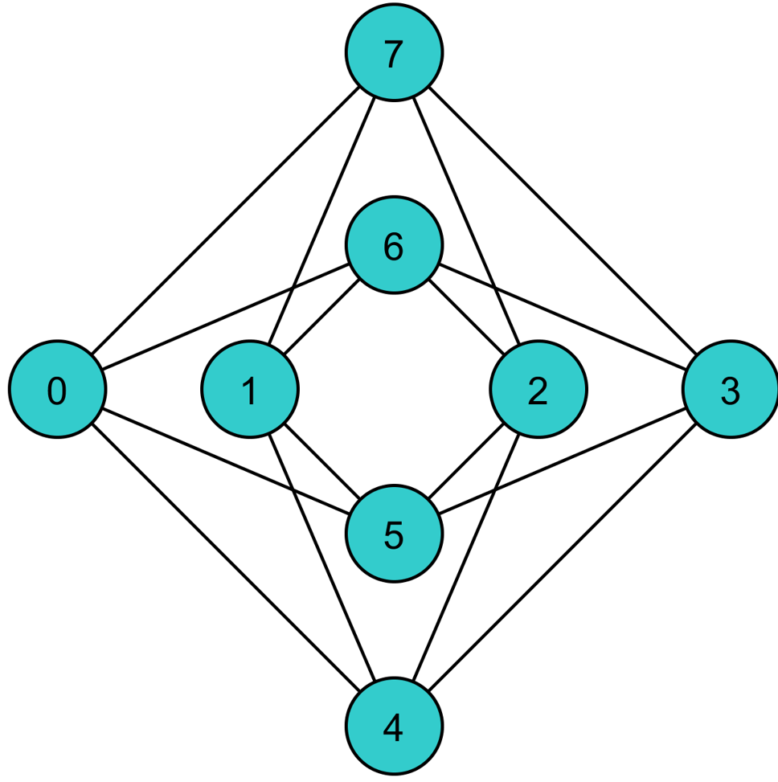
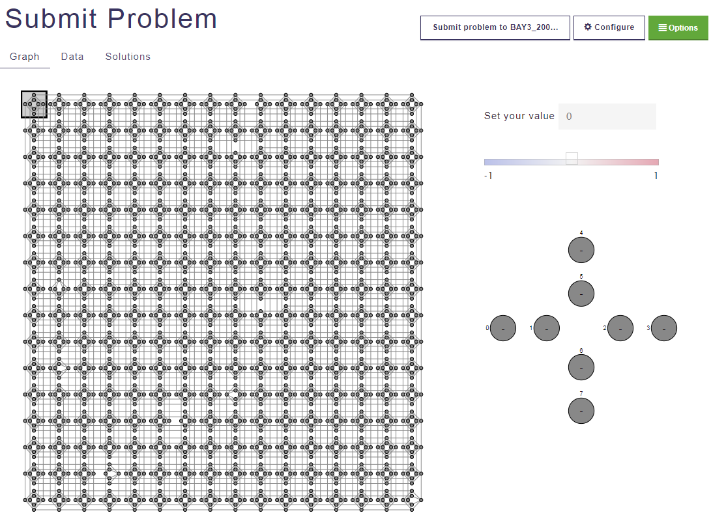

.. _Em:

=====================================================
Minor-Embedding a Problem onto the Chimera Graph
=====================================================

In this chapter, we show how to minor-embed the QUBO created in the previous chapter
into a Chimera graph. Minor embedding often requires *chains*, which are described here.
A solution received from the QPU can be unembedded by reversing the embedding steps.

.. note::
  While this example is intended to walk you through the minor-embedding and unembedding process
  for a simple problem so that you understand how it works, be aware that D-Wave has automatic
  embedding and unembedding tools available through the client libraries to streamline this process.
  See the developer documentation available from |ui| for more information.

Create a Chain
===================

To determine how a triangular graph fits on the Chimera graph, we need to
take a closer look at the Chimera structure shown in :numref:`Figure %s <unit-cell>`.
Notice that there is no way to set up 3 qubits in a closed loop to achieve the triangle graph
configuration of :numref:`Figure %s <triangle>`. However, we can make a closed
loop of 4 qubits using, say, qubits 0, 1, 4, and 5.

  Chimera unit cell.

To fit the 3-qubit loop into a 4-sided structure, we create a chain of 2 physical qubits
that will represent a single variable; see :numref:`Figure %s <embedding>`. In this case,
we chain qubit 0 and qubit 5 to represent variable :math:`b`.

.. figure:: images/embedding.png
  :name: embedding
  :alt: Embedding a triangular graph into Chimera by using a chain.

  Embedding a triangular graph into Chimera by using a chain.

The strength of the coupler between :math:`q_0` and :math:`q_5`, which we want to represent variable
:math:`b`, must be set to correlate the qubits strongly (discussed next), so that in most optimal solutions,
:math:`q_0 = q_5 = b`. The mapping from variables to qubits is known as *minor embedding*.

.. raw:: latex

  \newpage

Choose the Unit Cells to Work With
=============================================

As explained in the :ref:`Testing` chapter, the subset of the Chimera graph
accessible to users is the working graph. Before embedding a
problem on the working graph, review the physical layout of the QPU to understand
which qubits and couplers are absent from the fabric and therefore which unit cells
are good choices. :numref:`Figure %s <qprob3>` shows a working graph
where the unit cell in the upper left, containing qubits 0 through 7, is intact.

To access a picture of the graph for a given solver: from the |ui| Home page, click
**Solvers Visualizer**, then **View Graph Data**.

  Chimera working graph available through |ui|.

Map the Problem Parameters to the Working Graph
======================================================

Now, we translate the work we did in the previous step to map the problem to the actual
working graph of the physical QPU . We already know which variables we want
to map to which qubit, and we know the node biases and edge strengths from our original
graph. Node biases translate to qubit biases for the qubits that represent variables
:math:`a` and :math:`c`. See the tables below.

..
  .. figure:: images/unravel.png
    :name: unravel
    :alt: Mapping the problem parameters to the working graph.

    Mapping the problem parameters to the working graph.

========================= ===== ===== ===== =====
Qubit                     0     5     4     1
Variable                  b     b     a     c
Bias                      ?     ?     -1    -1
========================= ===== ===== ===== =====

========================= ===== ===== ===== =====
Coupler                   (0,4) (5,0) (4,1) (1,5)
Strength                  2     ?     2     2
========================= ===== ===== ===== =====

But what about the 2 qubits that represent variable :math:`b` and the coupling strength
between them? We need a strong negative coupler to chain qubits 0 and 5 thereby
create a single logical qubit with the connectivity we need. We also need to
add to the existing qubit values to compensate for the negative coupling we are adding.\ [#]_

.. [#]
  In the Ising model, we can introduce a bias on the quadratic term without changing the ground state of the problem.
  For a QUBO problem, however (as we have here), changing the bias on the quadratic term changes the ground state
  unless we compensate by adding biases (0.5 of the quadratic bias) to each of the two linear terms.

This process requires a few steps:

1. Evenly split the bias of :math:`-1` from variable :math:`b` between :math:`q_0` and :math:`q_{5}`.
   Now the bias of these 2 qubits is :math:`-0.5`.
2. Choose a strong negative coupling strength for the chain between :math:`q_0` and :math:`q_{5}`. In this example, we arbitrarily
   choose :math:`-3` as a coupling strength because it is a stronger value than the other couplers around it and is negative,
   which forces the 2 qubits to be equal.
3. We now need to add :math:`1.5` to each bias of :math:`q_0` and :math:`q_{5}` to compensate for the :math:`-3` we added in step 2. Now the bias for both :math:`q_0` and :math:`q_{5}` is :math:`1`.
4. Finally, we normalize the entire graph to fit within the physical bounds of the system by dividing by all values by :math:`3`
   so that the largest coupler strength is :math:`-1`.

Our resulting values are as follows, with the chained qubits having the strongest negative coupling (:math:`-1`):

========================= ====== ====== ====== ======
Qubit                     0      5      4      1
Variable                  b      b      a      c
Bias                      0.33   0.33   -0.33  -0.33
========================= ====== ====== ====== ======

========================= ====== ====== ====== ======
Coupler                   (0,4)  (5,0)  (4,1)  (1,5)
Strength                  0.667  -1     0.667  0.667
========================= ====== ====== ====== ======

The problem can be sent to the QPU for solution, via SAPI, through either the client libraries or |ui|.
See the :ref:`py` chapter for an example.

.. raw:: latex

  \newpage

Unembed the Solution
=============================

After the QPU has solved the exactly-one-true problem and returned a sample of solutions
to the embedded problem, those solutions must be *unembedded* to obtain solutions to the original
problem.

Possible returned values for our problem are:

* :math:`q_0 = 1`
* :math:`q_{5} = 1`
* :math:`q_{4} = 0`
* :math:`q_1 = 0`

Reverse the embedding process to get the solution to our original problem:

* :math:`a = q_{4} = 0`
* :math:`b = q_0, q_{5} = 1`
* :math:`c = q_1 = 0`

And this gives us one of the three expected solutions:

.. math::

  (a, b, c) = (0, 1, 0).

..
  .. figure:: images/unembed.png
    :name: unembed
    :alt: Unembedded a solution

    Unembedding a solution from the QPU to get a solution to the original problem.

Other possible solutions are :math:`(1, 0, 0)` and :math:`(0, 0, 1)`.

.. note::
  If a chain is broken, two strongly coupled qubits might "disagree" on what their logical value
  should be. To address this issue, SAPI includes postprocessing utilities that convert
  solutions with broken chains into intact solutions.
