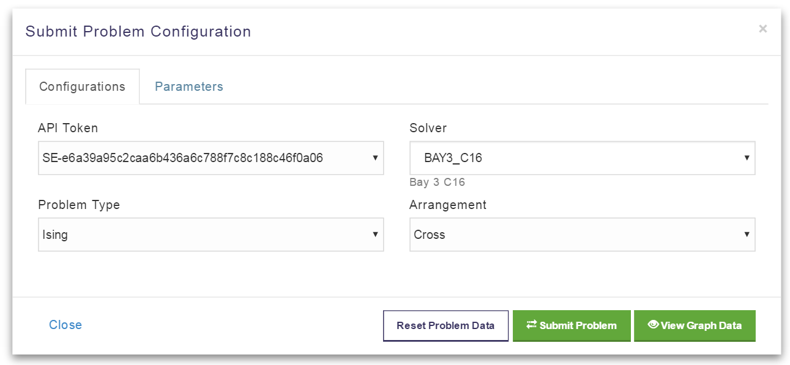
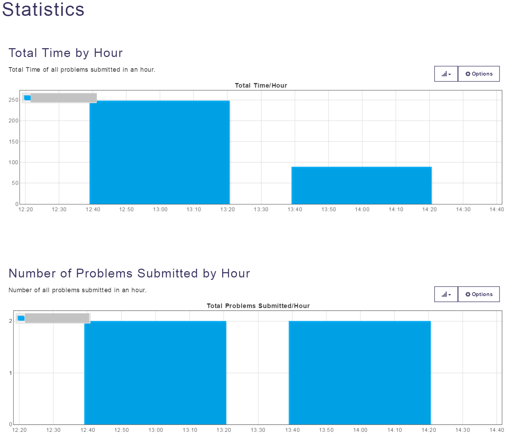

===============================================================
Managing Problems Using Qubist
===============================================================

Most functions available to you through the client libraries are also possible via |ui|.
Before you can submit a problem to the system, you must be assigned to a project
and have an API token.

Submit a Problem to the System
---------------------------------------------

When you submit a problem to the |dwave_short| system, your request is packaged into a solve request locally,
which is sent to the quantum solver operating at a remote location. The solver processes the problem and returns the
solution to your client application or browser window.

.. note::
    For problems submitted in QUBO format, SAPI first converts them into Ising format. See :ref:`Concepts` for more information
    about these formats.

  Defining a problem: configuration.

1. Select **Solvers Visualizer > Submit Problems** to access the page where you can define a problem; see :numref:`Figure %s <qubist-problem1>`.
2. Select an API token and solver.
3. Specify the problem type: Ising or QUBO.
4. Choose a solver.
5. Specify the arrangement of qubits: cross (default) or column.
6. Click **Parameters** to define additional parameters for the problem; see :numref:`Figure %s <qubist-problem2>`.
  | You can optionally define such things as:

  * Answer mode
  * Number of reads
  * Maximum number of answers
  * Automatic scaling
  * Number of spin-reversal transforms
  * Postprocessing mode
  * Beta (relevant only for sampling postprocessing)
  * Timing parameters, such as annealing time and thermalization time

  .. figure:: images/vfyc_default_sampling2.png
    :scale: 60 %
    :name: qubist-problem2

    Defining a problem: parameters.

  .. note::
    For more information about the solvers and the available parameters, including permitted ranges and default values,
    see the relevant developer guide for your client. For detailed information about postprocessing and
    system timing, see |doc_pp| and |doc_timing|.

7. To further define the problem on the Chimera graph, click **View Graph Data**; see :numref:`Figure %s <qubist-problem3>`.
  | You can:

  * Select the portions of the Chimera graph on which you want to run the problem.
  * Control which qubits are used.
  * Set the qubit bias and the coupler strength within the permitted range, either by adjusting the slider or entering a value in the **Set Your Value** field.
  * Create qubit chains.

  .. figure:: images/qubist-problem3.png
    :name: qubist-problem3

    Defining a problem: graph data.

  Alternatively, you can ask the system to generate a random problem for you based on the working graph.
  To do so, click **Options > Generate Random Problem**.

8. To view or modify the values in the problem Hamiltonian, click **Data**; see :numref:`Figure %s <qubist-problem3>`.

  .. figure:: images/qubist-problem4.png
    :scale: 60 %
    :name: qubist-problem4

    Defining a problem: Hamiltonian.

9. When the problem is defined to your satisfaction, click **Submit Problem** to send the problem to the solver.

Save Problem Configurations
----------------------------
After you have defined a problem, you can save it so you can submit it later.
You can also modify a problem so you can rerun it with different parameters.

1. From the Submit Problem page, click **Save or Load Configurations**.
2. Assign a name and description to your problem and click **Save**.

Manage Submitted Problems
--------------------------
Unless you are a system administrator, who can access all problems assigned to their projects, you can only view and manage the problems that you have submitted.

1. Select **Solvers Visualizer > Problem Status**.
2. Here you can view details of submitted problems, as well as cancel those that are not yet complete.

View User Statistics
---------------------
You can access usage statistics for your account by date, solver, group, or project.

1. From the top menu, click your user name and select **Statistics**.
2. Filter as desired, and click **Query Data**; see :numref:`Figure %s <qubist-stats>`.

  Statistics.
