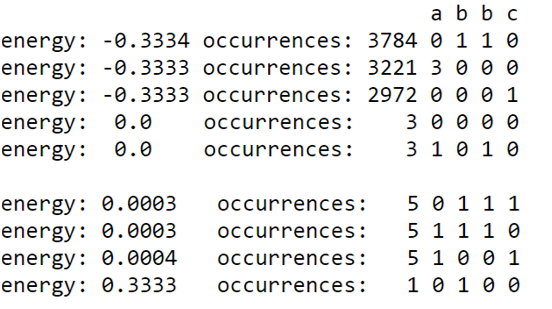

.. _py:

============================================
Submitting a Problem to the D-Wave System
============================================

This chapter shows the basics of how
to submit a problem to the system using Python, one
of the supported client libraries. See the C, MATLAB, and Python
guides available on |ui| for complete documentation on
making calls to SAPI using these libraries.

The examples provided here assume that you have already defined a problem that can
be expressed on the working graph; see the preceding chapters to see how
to get to this point.

.. note::
  Normally, you find an embedding using SAPI calls before sending a problem for solution.
  Otherwise you risk sending the problem to an incomplete unit cell. However, because we have
  worked out the correct embedding for a system with the necessary qubits present, we can
  send the problem as shown below.

When you submit a problem, you must know the name of the solver you are submitting it to.
Find out the solver name and look at its properties and the parameters that it accepts.
You can do this either through |ui| or by making client library calls to SAPI.
For more information about interacting with solvers, see the client library documentation
available on |ui|.

Submit the Problem
======================

Before you can submit a problem, ensure that:

* You are assigned to a project
* You have an API token
* You know the name of the solver you want to use and the parameters you want to set
  (these examples show the use of the ``num_reads`` parameter)

This example shows Python code to connect to the solver, build the problem definition matrix,
send the problem to the QPU, and output the states returned by the QPU.
It does 1 *read* of the problem (also known as a *sample*).

To submit the problem:

1. Obtain the URL you need to make a remote connection to the D-Wave system.
   To find this, log on to |ui| and click **Solver API**.  The URL is provided
   under the heading **Connecting to SAPI**.

2. If you do not already have an API token, generate one through |ui|.

3. Establish a remote connection to the D-Wave system; provide the URL and token you
   obtained in the previous steps. This sample Python script below outputs the names of the solvers
   that are available to you.

.. code-block:: python

  import dwave_sapi2.remote
  import dwave_sapi2.core

  url = 'url-from-qubist'
  token = 'api-token-from-qubist'
  proxy = ''  # You may not need a proxy server address.

  connection = dwave_sapi2.remote.RemoteConnection(url, token, proxy)
  connection.solver_names()

4. Run the problem using the solver.

.. code-block:: python

  solver = connection.get_solver('solver-name')

  linear_values = {(0, 0): 0.3333, (1, 1): -0.333, (4, 4): -0.333, (5, 5): 0.333,}
  quadratic_values = {(0, 4): 0.667, (0, 5): -1, (1, 4): 0.667, (1, 5): 0.667}

  Q = dict(linear_values)
  Q.update(quadratic_values)

  result = solver.solve_qubo(solver, Q, num_reads=1)

  for state, energy, occur in zip(result['solutions'], result['energies'],
    result['num_occurrences']):
    print 'energy: {:>4} occurrences: {:>3}'. format(energy, occur), state[0:6]

4. The system returns the output energy and annealed states of qubits.

.. code-block:: python

  energy: -0.3334 occurrences: 1 [1, 0, 3, 3, 0, 1]

Check the Solution
======================

Let's take a look at the solution, mapping it back to the variables in our
original problem. We have a valid solution to the exactly-one-true problem: :math:`a` and :math:`c`
are FALSE; :math:`b` is TRUE. Both of the chained qubits, 0 and 5, return the same value.

====================== ========== ========== ========== ========== ========== ==========
**Variables**          b          c                                a          b
**Qubit**              0          1          2          3          4          5
**Returned Values**    1          0          3          3          0          1
====================== ========== ========== ========== ========== ========== ==========

Increase the Number of Reads
================================

Here, we increase the number of reads to 10000 and modify the output so that only the qubits that
represent the variables (:math:`a`, :math:`b`, :math:`c`) in our problem are included in the results.
Increasing the number of reads usually returns more variation in the returned solutions.

.. code-block:: python

  result = solve_qubo(solver, Q, num_reads=10000)

  for state, energy, occur in zip(result['solutions'], result['energies'],
    result['num_occurrences']):
    print 'energy: {:>4} occurrences: {:>3}'. format(energy, occur),
      state[4], state[0], state[5], state[1]

In the results of 10000 reads (:numref:`Figure %s <sampling-range>`), we can see that the lowest energy occurs for the 3
valid states for our problem. Although there are only 3 valid answers to our 3-variable exactly-one-true problem,
6 unique states are returned. The lowest energy occurs for the 3 valid states, which are by far the most frequent
solution. Returning a range of solutions is useful for sampling problems.

  Results of 10000 reads.
