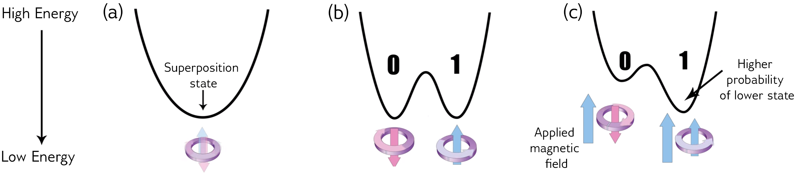
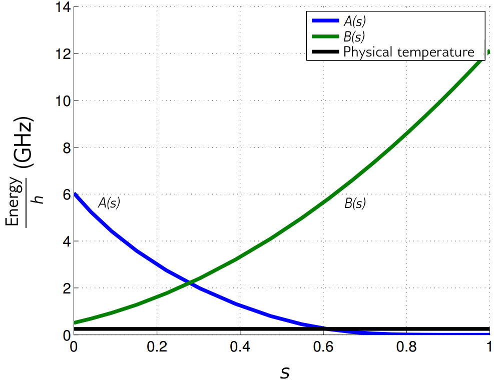

===================================
Introduction to Quantum Annealing
===================================

This chapter explains what quantum annealing is
and how it works, and introduces the underlying
quantum physics that governs its behavior. For more
detail on quantum annealing in D-Wave systems, see
|doc_proc|.

Applicable Problems
============================

Quantum annealing processors naturally return low-energy solutions; some applications
require the real minimum energy and others require good low-energy samples.
This approach is best suited to solving discrete optimization problems and
probabilistic sampling problems.

**Optimization problems.** In an optimization problem,
we search for the best of many possible combinations.
Optimization problems include scheduling challenges, such
as "Should I ship this package on this truck or the next one?"
or "What is the most efficient route a traveling
salesperson should take to visit different cities?"

..
  .. figure:: images/house.png
    :name: house
    :scale: 50 %
    :alt: Finding the best way to build a house on a fixed budget is a simple example of an optimization problem.

    Finding the best way to build a house on a fixed budget is a simple example of an optimization problem.
    The shapes on the left represent the components of a house: walls, chimneys, parts of the roof, and so on.

Physics can help solve these sorts of problems because we can
frame them as energy minimization problems. A fundamental
rule of physics is that everything tends to seek
a minimum energy state. Objects slide down hills; hot
things cool down over time. This behavior is also true in
the world of quantum physics. Quantum annealing simply uses quantum
physics to find low-energy states of a problem and therefore
the optimal or near-optimal combination of elements.

**Sampling problems.** Sampling from many low-energy states and
characterizing the shape of the energy landscape is useful for
machine learning problems where we want to build a probabilistic
model of reality. The samples give us information
about the model state for a given set of parameters, which can then be
used to improve the model.

Probabilistic models explicitly handle uncertainty by accounting for
gaps in our knowledge and errors in data sources. Probability distributions represent
the unobserved quantities in a model (including noise effects) and how they relate to
the data. The distribution of the data is approximated based on a finite set of samples.
The model infers from the observed data, and learning occurs as it transforms the prior
distribution, defined before observing the data, into the posterior distribution, defined
afterward. If the training process is successful, the learned distribution resembles
the distribution that generated the data, allowing predictions to be made on unobserved data.
For example, when training on the famous MNIST dataset of handwritten digits, such a
model can generate images resembling handwritten digits that are consistent with the training set.

Sampling from energy-based distributions is a computationally intensive task
that is an excellent match for the way that the |dwave_short| system solves
problems; that is, by seeking low-energy states.

How Quantum Annealing Works in D-Wave Systems
==========================================================

The quantum bits---also known as *qubits*---are the lowest energy states of
the niobium loops that make up the D-Wave QPU. These states have a circulating
current and a corresponding magnetic field.
As with classical bits, a qubit can be in state of 0 or 1;
see :numref:`Figure %s <superp>`.
But because the qubit is a quantum object, it can also be in a superposition of the 0 state and
the 1 state at the same time. At the end of the quantum annealing process, each qubit collapses from a
superposition state into either 0 or 1 (a classical state).

.. figure:: images/01.png
  :name: superp
  :scale: 50 %
  :alt: A qubit's state is implemented in a circulating current with a corresponding magnetic field.

  A qubit's state is implemented as a circulating current, shown clockwise for 0 and counter clockwise for 1,
  with a corresponding magnetic field.

The physics of this process can be shown (visualized) with an energy diagram as in :numref:`Figure %s <change>`.
This diagram changes over time, as we can see in (a), (b), and (c). To begin, there is just one valley (a), with a single minimum.
The quantum annealing process runs, the barrier is raised, and this turns the energy diagram into what is
known as a *double-well potential* (b). Here, the low point of the left valley corresponds to the 0 state,
and the low point of the right valley corresponds to the 1 state. The qubit ends up in one of these valleys
at the end of the anneal.

  Energy diagram changes over time as the quantum annealing process runs and a bias is applied.

Everything else being equal, the probability of the qubit ending in the 0 or the 1 state is equal (50 percent). We
can, however, control the probability of it falling into the 0 or the 1 state by applying an external magnetic
field to the qubit (c). This field tilts the double-well potential, increasing the probability of the qubit ending up in the
lower well. The programmable quantity that controls the external magnetic field is called a *bias*, and the qubit
minimizes its energy in the presence of the bias.

The bias term alone is not useful, however. The real power of the qubits comes when we link them
together so they can influence each other. This is done with a device called a *coupler*. A coupler
can make two qubits tend to end up in the same state---both 0 or both 1---or it can make them tend to be in
opposite states. Like a qubit bias, the correlation weights between coupled qubits can be programmed by setting
a coupling strength. Together, the programmable biases and weights are the means by which a problem is
defined in the D-Wave system.

When we use a coupler, we are using another phenomenon of quantum physics called entanglement.
When two qubits are entangled, they can be thought of as a single object with four possible states. :numref:`Figure %s <4states>`
illustrates this idea, showing a potential with four states, each corresponding to a different combination of the
two qubits: (0,0), (0,1), (1,1), and (1,0). The relative energy of each state depends on the biases of qubits and the coupling between them.
During the anneal, the qubit states are potentially delocalized in this landscape before finally settling into (1,1) at the end of the anneal.

.. figure:: images/4states.png
  :name: 4states
  :scale: 45 %
  :alt: Energy diagram showing the best answer.

  Energy diagram showing the best answer.

As we have seen, each qubit has a bias and qubits interact via the couplers. When formulating a problem,
users choose values of the biases and couplers. The biases and couplings define
an energy landscape, and the D-Wave quantum computer finds the minimum energy of that
landscape: this is quantum annealing.

As we add qubits, systems get increasingly complex. With two qubits, we have four possible states over
which to define an energy landscape. At three qubits, we have eight. For each qubit we add, we double
the number of states over which we can define the energy landscape: the number of states goes up
exponentially with the number of qubits.

In summary, we start with a set of qubits, each in a
superposition state of 0 and 1. They are not yet coupled.
When they undergo quantum annealing, the couplers and biases are
introduced and the qubits become entangled. At this point, the system is
in an entangled state of many possible answers. By the end of the anneal, each qubit is in a
classical state that represents the minimum energy state
of the problem, or one very close to it. All of this happens in D-Wave
systems in a matter of microseconds.

.. raw:: latex

  \newpage

Underlying Quantum Physics
===================================

This section discusses some concepts essential to understanding
the quantum physics that governs the D-Wave quantum annealing process.

The Hamiltonian and the Eigenspectrum
------------------------------------------------

A classical Hamiltonian is a mathematical description of some physical system
in terms of its energies. We can input any particular state of the system,
and the Hamiltonian returns the energy for that state. For most non-convex Hamiltonians,
finding the minimum energy state is an NP-hard problem that classical computers cannot solve efficiently.

As an example of a classical system, consider an extremely simple system of a
table and an apple. This system has two possible states: the apple on the table,
and the apple on the floor. The Hamiltonian tells us the energies, from which we
can discern that the state with the apple on the table has a higher energy than
that when the apple is on the floor.

For a quantum system, a Hamiltonian is a function that maps certain states, called *eigenstates*,
to energies. Only when the system is in an eigenstate of the Hamiltonian is its energy well defined
and called the *eigenenergy*. When the system is in any other state, its energy is uncertain.
The collection of eigenstates with defined eigenenergies make up the *eigenspectrum*.

For the D-Wave system, the Hamiltonian may be represented as

.. math::
	:nowrap:

	\begin{equation}
			{\cal H}_{ising} = \underbrace{\frac{A({s})}{2} \left(\sum_i {\hat\sigma_{x}^{(i)}}\right)}_\text{Initial Hamiltonian} + \underbrace{\frac{B({s})}{2} \left(\sum_{i} h_i {\hat\sigma_{z}^{(i)}} + \sum_{i>j} J_{i,j} {\hat\sigma_{z}^{(i)}} {\hat\sigma_{z}^{(j)}}\right)}_\text{Final Hamiltonian}
	\end{equation}

where :math:`{\hat\sigma_{x,z}^{(i)}}` are Pauli matrices operating on a qubit :math:`q_i`, and
:math:`h_i` and :math:`J_{i,j}` are the qubit biases and coupling strengths.\ [#]_

.. [#]
  Nonzero values of :math:`h_i` and :math:`J_{i,j}` are limited to those available in the working graph; see the :ref:`Testing` chapter.

The Hamiltonian is the sum of two terms, the *initial Hamiltonian* and the *final Hamiltonian*:

* Initial Hamiltonian (first term)---The lowest-energy state of the initial Hamiltonian is
  when all qubits are in a superposition state of 0 and 1.
  This term is also called the *tunneling Hamiltonian*.
* Final Hamiltonian (second term)---The lowest-energy state of the final Hamiltonian is the answer
  to the problem that we are trying to solve. The final state is a classical state, and includes the qubit
  biases and the couplings between qubits.
  This term is also called the *problem Hamiltonian*.

In quantum annealing, we begin in the lowest-energy eigenstate of the initial Hamiltonian.
As we anneal, we introduce the problem
Hamiltonian, which contains the biases and couplers,
and we reduce the influence of the initial Hamiltonian. At
the end of the anneal, we are in an eigenstate
of the problem Hamiltonian. Ideally, we have stayed
in the minimum energy state throughout the quantum
annealing process so that---by the end---we are in the
minimum energy state of the problem Hamiltonian and
therefore have an answer to the problem we want to
solve. By the end of the anneal, each qubit is a classical object.

Annealing in Low-Energy States
----------------------------------------------------------------

A plot of the eigenenergies versus time is a useful way to visualize the quantum annealing process.
The lowest energy state during the
anneal---the *ground state*---is typically shown at the bottom, and any
higher excited states are above it; see :numref:`Figure %s <eigenspectrum>`.

.. figure:: images/eigenspectrum.png
  :name: eigenspectrum
  :scale: 65 %
  :alt: Eigenspectrum, where the ground state is at the bottom and the higher excited states are above.

  Eigenspectrum, where the ground state is at the bottom and the higher excited states are above.

As an anneal begins, the system starts in the lowest energy
state, which is well separated from any other energy
level. As the problem Hamiltonian is introduced,
other energy levels may get closer to the ground state. The
closer they get, the higher the probability that the system
will jump from the lowest energy state into one
of the excited states. There is a point during the anneal
where the first excited state---that with the lowest energy apart
from the ground state---approaches the ground state closely and
then diverges away again. The minimum distance between the ground state
and the first excited state throughout any point in the anneal is called the
*minimum gap*.

Certain factors may cause the system to jump from the ground state into a
higher energy state. One is thermal fluctuations that exist in
any physical system. Another is running the annealing process too quickly.
An annealing process that experiences no interference from outside energy
sources and evolves the Hamiltonian slowly enough is called an *adiabatic*
process, and this is where the name *adiabatic quantum computing* comes from.
Because no real-world computation can run in perfect isolation, quantum annealing
may be thought of as the real-world counterpart to adiabatic quantum computing, a theoretical ideal.
In reality, for some problems, the probability of staying in the ground state can
sometimes be small; however, the low-energy states that are returned are still
very useful.

For every different problem that you specify, there
is a different Hamiltonian and a different corresponding
eigenspectrum. The most difficult problems, in terms of
quantum annealing, are generally those with the smallest minimum gaps.

Evolution of Energy States
----------------------------------

:numref:`Figure %s <annealing-functions>` shows the evolution of the energy functions
over time while physical temperature remains constant. This chart plots :math:`\frac{\rm Energy}{h}`
in GHz, where :math:`h` is the Planck constant,\ [#]_ against :math:`s`,
the *normalized anneal fraction*, an abstract parameter ranging from 0 to 1. The
:math:`A(s)` curve is the tunneling energy and the :math:`B(s)` curve is the problem Hamiltonian energy at :math:`s`.
A linear anneal sets :math:`s = t / t_f`, where :math:`t` is time and :math:`t_f` is the total time
of the anneal. At :math:`t=0`, :math:`A(0) \gg B(0)`, which leads to the quantum ground state of the
system where each spin is in a delocalized combination of its classical states. As the system is annealed,
:math:`A` decreases and :math:`B` increases until :math:`t_f`, when the final state of the qubits represents
a low-energy solution.

.. [#]
  :math:`6.6 \times 10^{-34}` joule-seconds

At the end of the anneal, the Hamiltonian contains the only :math:`B(s)` term. It is a classical
Hamiltonian where every possible classical bitstring (that is, list of qubit states that
are either 0 or 1) corresponds to an eigenstate and the eigenenergy is the classical energy
objective function we have input into the system.

  Annealing functions :math:`A(s)`, :math:`B(s)`. Annealing begins at :math:`s=0` with :math:`A(s) \gg B(s)` and ends at :math:`s=1` with :math:`A(s) \ll B(s)`. Data shown are representative of |dwave_short| 2X systems.

Annealing Controls
=======================

We continue to understand more deeply the fine details of quantum
annealing and devise better controls for it. The release of the D-Wave 2000Q system
includes features that give users programmable control over the annealing schedule, which
enable a variety of searches through the energy landscape. These controls
can improve both optimization and sampling performance for certain types of problems, and can
help investigate what is happening partway through the annealing process.

For more information about the available annealing controls, see |doc_proc|.

..
  **Anneal offsets.** In the standard application of quantum annealing in D-Wave systems, all qubits evolve
  simultaneously, experiencing equal changes to tunneling energy and making an equal contribution
  to the classical energy function. In some situations, however, it is beneficial to
  offset the annealing paths of the qubits, so that some are annealed slightly before others.
  This technique can improve both optimization and sampling performance for certain types
  of problems.

  **Support for variations on the global anneal schedule.** By default, qubits evolve according
  to a predetermined schedule, in which energy changes smoothly as a function of scaled time.
  Some types of research, however, may benefit from more fine-grained adjustments to the default
  anneal schedule. Users can change the shape of the energy waveform by providing points at which to *pause* or
  *quench* (i.e., abruptly terminate) the anneal process. Anneal schedule changes apply to all qubits in the
  working graph.
