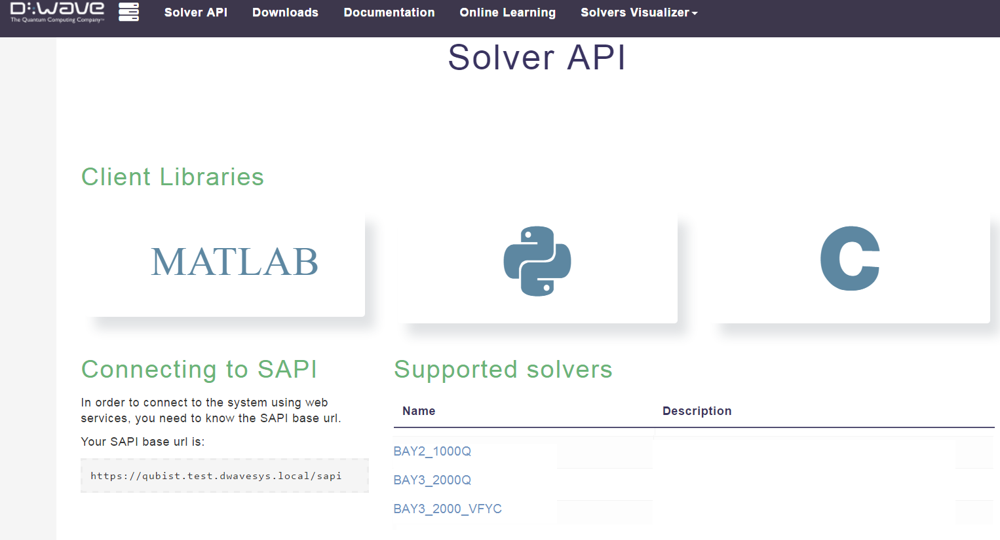
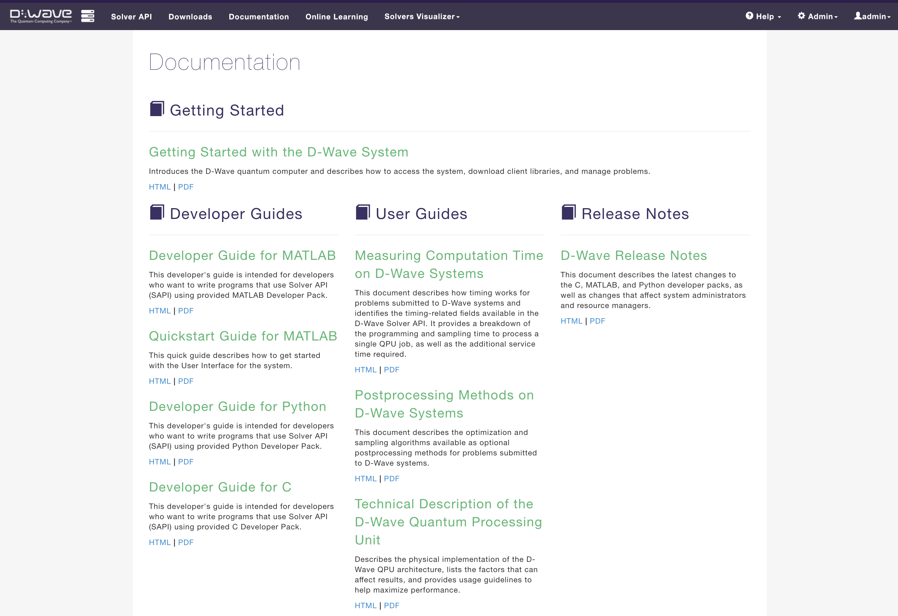

.. _Libs:

===================================
Accessing Additional Resources
===================================

Client Libraries
===================

The following client libraries are available for download from |ui|:

* C
* MATLAB
* Python

The library packages include interfaces to the system for each programming language
as well as examples and utilities.

To download the client libraries:

1. Click **Downloads** from the top menu of |ui|; see :numref:`Figure %s <client-lib-download>`.

  Client libraries: download.

2. Click on the library you want to download.
3. Check the library download page for any notes about support for release versions.
4. Select the appropriate download for your operating system: Linux, Mac, or Windows.

System Documentation
===================================

A number of end-user documents are available in HTML and PDF format from the **Documentation**
page in |ui|; see :numref:`Figure %s <qubist_docs>`.
Also available here are documents for system administrators and resource managers,
which may not be visible to you depending on your user role and corresponding system access.

  D-Wave documentation.

  .. raw:: latex

    \newpage

Detailed Examples
===================================

A number of detailed examples are available from D-Wave, showing how to use different features and applications
of the system. Contact D-Wave Support for access. Some of the key examples are described below.

SAT Filter
------------------------------------

A critical and pervasive task in large-scale data analytics is to determine whether
a given item is an element of a given data set. Filters can be used to accelerate the
lookup task by eliminating large blocks of data from the search, so that analysis
algorithms act only on data with potential relevance. For example, virus scanners may
use filters to accelerate virus detection by eliminating sets of qualified codes
from the detection algorithm. The efficiency of a filter is determined by a measure
of the false-positive rate (how many irrelevant items were not eliminated from the search)
versus the storage needed to represent the filter.

This example uses |dwave_short| system samples to build a particularly efficient filter known as
a *satisfiability (SAT) filter* that allows a set to be filtered with no false negatives and a
false-positive rate approaching zero.

Restricted Boltzmann Machine
------------------------------------------------

Finding patterns or statistical regularities present in datasets is a critical function of machine-learning algorithms.
Exemplary data are presented to algorithms that use these *training sets* to create representations of the data.

In this example, we provide a training set representing numerical addition relationships, without explicitly expressing that the data
correspond to addition. This training set is processed and used to create samples from the |dwave_short| system that
generate a statistical model of the data. The statistical model, known as a *Restricted Boltzmann Machine*, uncovers
the statistical structure of the training set and learns how to represent it and perform numerical addition. Integrating
high-quality samples from the |dwave_short| system yields a better statistical model than those based on samples from
state-of-the-art classical heuristics, including contrastive-divergence and persistent contrastive-divergence algorithms.

Structured Prediction
----------------------------------------

Online multimedia platforms, social media, and mobile technologies have led to the unprecedented generation of
audio and visual data. These data often contain structures that can be leveraged to improve functions such as
data compression, search, and marketing analyses. Automating the classification of structures within datasets through *structured prediction*
is critical to the future scaling and richer integration of these technologies. An example of structured
prediction in computer vision is to segment the pixels of an image into separate classes, such as foreground and
background. Segmentation errors are reduced by learning the relationship structures among pixels.

This example works to maximize prediction accuracy by learning the relationships between classes of data.
It shows how the |dwave_short| system can be applied to solve specific hard problems that arise within the
conditional random fields and structured support vector machine classification methods.

Chimera Embedding
-------------------------------------

The |dwave_short| QPU minimizes the energy of an Ising spin configuration whose pairwise interactions lie on the
edges of a Chimera graph :math:`C_{M,N,L}`. To solve an Ising spin problem with an arbitrary pairwise interaction
structure, the corresponding graph must be minor-embedded into a Chimera graph.

The Chimera embedding example describes a collection of minor-embeddings of cliques into QPU working graphs,
which are highly uniform in structure and near minimal in size. The example explains how to construct a fully connected
graph embedding using the algorithm, and how to use an embedding to solve fully connected problems.
|dwave_short| has made the embedding algorithm and instructions available on github.\ [#]_

.. [#]
	https://github.com/dwavesystems/chimera-embedding

Anneal Offset
------------------------------

In the standard application of quantum annealing in |dwave_short| systems,
all qubits evolve simultaneously, experiencing equal changes to tunneling energy
and making an equal contribution to the classical energy function.
In some situations, however, it is beneficial to *offset* the annealing paths of
the qubits, so that some are annealed
slightly before others. This technique can improve both optimization and sampling
performance for certain types
of problems.

The anneal offset example is an interactive Jupyter notebook demonstrating
how to use this feature.

Anneal Schedule
-----------------

Some types of research may benefit from fine-grained adjustments to the default anneal
schedule. D-Wave has introduced features that enable you to change the shape
of the energy waveform by providing points
at which to *pause* or *quench* (i.e., abruptly terminate) the annealing process.
This level of control helps investigate what is happening partway through the process.

The anneal schedule example is an interactive Jupyter notebook demonstrating
how to use this feature.
