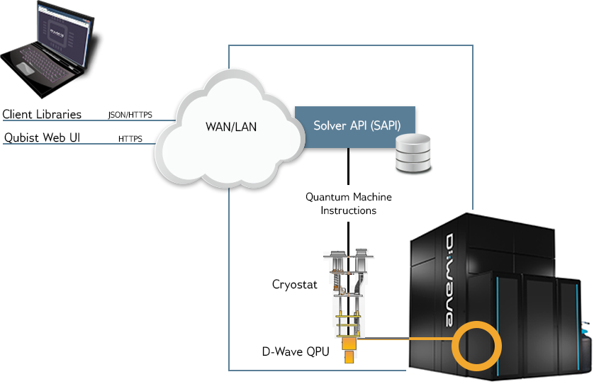

======================
Welcome to D-Wave
======================

.. pull-quote::

  *I'm not happy with all the analyses that go with just the classical theory, because Nature isn't classical,*
  *dammit, and if you want to make a simulation of nature, you'd better make it quantum mechanical, and by golly*
  *it's a wonderful problem, because it doesn't look so easy.*

  *It's not a Turing machine, but a machine of a different kind.*

  --- Richard Feynman, 1981\ [#]_

.. [#]
  Feynman, Richard P. "Simulating physics with computers." *International Journal of Theoretical Physics* 21, no. 6 (1982): 467-488.

What We Do
================

Despite the incredible power of today's supercomputers, many complex computing problems
cannot be addressed by conventional systems. The huge growth of data and our need to better
understand everything from the universe to our own DNA leads us to seek new tools that can
help provide answers. Quantum computing is the next frontier in computing, providing an
entirely new approach to solving the world's most difficult problems.

While certainly not easy, much progress has been made in the field of quantum computing since 1981,
when Feynman gave his famous lecture at the California Institute of Technology. Still a relatively
young field, quantum computing is complex and different approaches are being pursued around the
world. Today, there are two leading candidate architectures for quantum computers: gate model and
quantum annealing. In gate-model quantum computing, the aim is to control and manipulate the
evolution of the quantum states over time---a difficult challenge, especially at large scales,
because quantum systems are incredibly delicate.

At D-Wave, our approach is *quantum annealing*, which harnesses the natural evolution of quantum states:
we initialize the system in a delocalized state, we gradually turn on the description of the problem
we wish to solve, and quantum physics allows the system to follow these changes. The configuration
at the end corresponds to the answer we are trying to find. Quantum annealing is implemented in D-Wave
systems as a single quantum algorithm, and this scalable approach to quantum computing has enabled us to
create quantum processing units (QPUs) with more than 2000 quantum bits (*qubits*)---far beyond the
state of the art for gate-model quantum computing.

D-Wave has been developing various generations of our "machine of a different kind," to use Feynman's
words, since 1999. We are the world's first commercial quantum computer company.

.. _Intro:

Introducing the D-Wave System
===============================

This section describes the system at a high level. For more details on the physical system, for a description of
customer roles, and for essential safety information required for anyone who accesses the physical system,
see the |doc_ops| manual, which is available from D-Wave.

.. figure:: images/dwave.png
  :name: dwave-components
  :scale: 50 %

  D-Wave system.

Physical Description
-----------------------

The D-Wave system contains a QPU that must be must be kept at a temperature near absolute zero and
isolated from the surrounding environment in order to behave quantum mechanically.
The system achieves these requirements as follows:

* Cryogenic temperatures, achieved using a closed-loop cryogenic dilution refrigerator system.
  The QPU operates at temperatures below 15 mK.
* Shielding from electromagnetic interference, achieved using a radio frequency (RF)–shielded enclosure
  and a magnetic shielding subsystem.

Quantum Processing Unit
.........................

The D-Wave QPU (:numref:`Figure %s <qpu>`) is a lattice of tiny loops of the metal niobium, each of which
is a qubit or a coupler. Below temperatures of 9.2 kelvin, niobium becomes a superconductor and exhibits
quantum-mechanical effects.

The D-Wave 2000Q QPU has up to 2048 qubits and 6016 couplers.
To reach this scale, it uses 128,000 Josephson junctions, which makes
the D-Wave 2000Q QPU by far the most complex superconducting integrated
circuit ever built.

For details on the topology of the QPU, see the :ref:`Testing` chapter.

.. figure:: images/qpu.png
  :name: qpu
  :scale: 30 %

  D-Wave QPU.

Shielded Enclosure
......................

The RF-shielded enclosure is an electromagnetic-tight box that houses the cryostat, which is the
device responsible for holding the QPU in its cryogenic state.

Other Equipment
................

Three racks at the side of the enclosure house the equipment required for the operation of the D-Wave system:

* Server rack---Contains the data processing, system control, monitoring, network, and backup power resources for the system.
* Gas handling control rack---Contains gas manifolds and pumps that circulate the helium mix that cools the system.
* Pumping control rack---Houses the compressor required for cooling.

Liquid nitrogen cold traps adjacent to the enclosure purify the helium mix before it enters the cryostat.

D-Wave Software Environment
----------------------------

Users interact with the D-Wave quantum computer through a web user interface (UI), known as *Qubist*, and
through C, MATLAB, or Python client libraries that communicate with the Solver API (SAPI).\ [#]_
The SAPI components are responsible for user interaction, user authentication, and work scheduling. In turn,
SAPI connects to back-end servers that send problems to and return results from the QPU via quantum machine
instructions and that (optionally) run postprocessing algorithms on results.
See :numref:`Figure %s <network-gs>` for a simplified view of the D-Wave software environment.

.. [#]
  In the D-Wave system, a *solver* is simply a resource that runs a problem. Some solvers interface to the QPU; others leverage CPU and GPU resources.

  D-Wave software environment.

.. raw:: latex

  \newpage

The client libraries make it easier to code applications across various platforms.
They communicate with the SAPI web services component using the REST/HTTPS protocol and allow you to:

* Query available solvers and solver properties
* Submit problems
*	Cancel previously submitted problems
* Retrieve problem status
* Fetch results if successful
* Retrieve errors if unsuccessful

The D-Wave client libraries use a traditional request/response paradigm,
where the application code runs on a client system, and the client commands are translated
to REST/HTTP calls and then transmitted to the server. Client libraries are available for download from |ui|.
